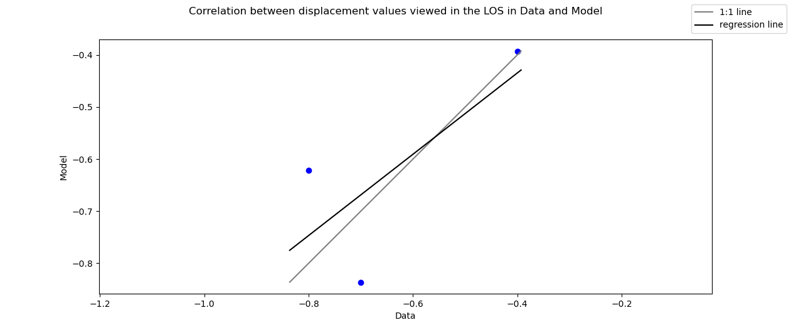

# SLBL - Failure Surface Analysis

This code presents the computation of the SLBL surface, providing a rough but quick approach to failure surface and
volume estimation for landslide using DEM. It shows the displacement along the surface failure, and compares the 3D
displacement with an external source providing displacement along a LOS (line of sight). The features are accessible via
a Qt interface.

An overview of methods estimating the surface failure of landslides is proposed
in: `A review of methods used to estimate
initial landslide failure surface depths and volumes, Jaboyedoff and al., 2020`.

This code has been developed by Leo Letellier during an internship at [Risk Group](https://wp.unil.ch/risk/) - UNIL (
Lausanne), in June-August 2023.

_**THIS IS RESEARCH CODE PROVIDED TO YOU "AS IS" WITH NO WARRANTIES OF CORRECTNESS.
USE AT YOUR OWN RISK.**_

## Contents

- [1. System Setup](#1-system-setup)
    - [1.1. Requirements](#11-requirements)
    - [1.2. Installation](#12-installation)
- [2. Python Files Organisation](#2-python-files-organisation)
- [3. Features](#3-features)
    - [3.1. SLBL Estimation](#31-slbl-estimation)
    - [3.2. Displacement Vectors](#32-displacement-vectors)
    - [3.3. Compare Displacement](#33-compare-displacement)
- [4. File Format](#4-file-format)
- [5. Project File](#5-project-file)

------

## 1. System Setup

This code is build on python and several packages available with anaconda or miniconda.

### 1.1. Requirements:

+ **python 3.11.4** (3.10 and 3.11 used for development)

* **pyside6** (interface)
* **pandas** (open files)
* **numpy** (arrays)
* **matplotlib** (graphs)
* **scipy** (interpolation, regression)
* **openpyxl** (open excel files)

+ bindings specifics to these packages

### 1.2. Windows Installation:

This repository contains several `.bat` files, which automated some process using Windows cmd. To use them, double-clic
on
them and wait for the console window to finish all process and close itself.

You need to install first python using [anaconda](https://www.anaconda.com/)
or [miniconda](https://docs.conda.io/en/latest/miniconda.html). Miniconda can be automatically installed by
launching `install_miniconda.bat`.
Then the python environment can be installed using the file `setup_environement.bat`. It will create an adequate
environment for this project to match packages versions (PySide6 and openpyxl are automatically installed using pip
after the setup of the environment as no channel of diffusion has been found).

Miniconda and the associated virtual environment are install in `%UserProfile%\Miniconda3`. It can be uninstalled an
anytime after use by running `uninstall_miniconda.bat`.

To launch the program, either open and run the script `ui_main_window.py` using the previous installed environment or
run the file `SLBL_SFA.bat`.

------

## 2. Python Files Organisation

* `[src]`
    * `LandslideAreanSLBL.py`: contains core variables and processing relative to the failure surface problem
    * `SlblToolKit.py`: contains useful and non-specific functions
    * ``project_manager.py``: handle project files
    * `ui_connection.py`: handles the connection between the python variables and processing, and the Qt interface

    + `ui_main_window.py`: initialises the Qt interface
    + `ui_form.py`: contains the main window's widgets
    + `ui_form_slbl.py`: contains the slbl window's widgets
    + `ui_form_comp_disp.py`: contains the comparative displacement window's widgets

* `[example]`: folder containing a test set for the code
    * `dem.csv`:  | x | z |
    * `disp.csv`: | x | disp |
    * `slbl.csv`: | x | slbl |

The figures presented in the following section are provided as reference based on this example data set.

------

## 3. Features

The interface is divided in three main windows, one for each main feature of the code.

The geometry is set as a cross-section, defined laterally along a x-axis and in height with a z-axis.

### 3.1. Failure Surface and SLBL Estimation

The SLBL surface failure estimation is based on a minimum-wise criteria, such as :
`z[i] = (z[i-1] + z[i+1]) / 2 - C`.

It has been introduced in
`Toward preliminary hazard assessment using DEM topographic analysis and simple mechanic modelling by mean of the
sloping local base level, Jaboyedoff and al., 2004`.

This criterion permits a matrix computation, used in this code. Such a disposition is defined by three parameters : the
x
value of the two extremities and a tolerance value relative to the first derivative function of the equivalent parabola.
The matrix linear equation is resolved using the tridiagonal matrix algorithm and doesn't require to compute an inverse
matrix.

With the interface, you can either load any surface you want or compute directly the SLBL.

The mods combine and sub permits simple geometrical association between SLBLs.

**Output graph:**

* 2D cross-section containing DEM data and SLBL data.

+ From input SLBL: 
+ From computed SLBL (Left=100m, right=500m, c=2): 

### 3.2. Displacement Vectors

* Basic Displacement:
    * Following the failure surface (orientation and slope angle of the vector)
    * Movement conserved along the section (normalized vector)
    * Same movement on all the height of one slide (perpendicular to the local slope)

This feature uses an intern parameter delta_x relative to the x-window in which we look for determining the blocks
orientation (here set to 400). The length of the displayed vectors is set automatically by matplotlib, so that the
display length can be only use to compare vectors between them.

It computed n_vec vectors between the left and right limits.

**Output graphs:**

* 2D cross-section containing DEM and SLBL data, with the landslide's slides and the displacement vectors.

+ Using computed SLBL (n_vec=10, left=100, right=500): 

### 3.3. Displacement Model

* Multi-layered Model:
    * Global displacement is the sum of weigthed basic displacement for each failure surface

The weights are coefficients for each slide. They can be set manually or computed by least square if the
displacement data is already loaded.

As some remote sensing acquisition methods (such as InSAR) retrieve the displacement along a LOS (line of sight), some
corrections are needed to compare displacement with each other. Thus, the obtained 3D displacements from the model are
projected in the LOS are the displacement data.

The LOS is projected into the cross-section for each point of data, and the vector is displayed with the length
corresponding to the displacement value at that point (red vectors).

The alpha angle (oriented azimuth of the cross-section) is taken clockwise from the North.
The delta angle (azimuth of the LOS = azimuth of satellite + 90°) is taken clockwise from the North.
The theta angle (incidence angle) is taken between the nadir and the incident look.

**Output Graph**

* 2D cross-section with points displayed along the x-axis whose color represents the displacement value of the reference
  displacement data. Gives the ratios used for each slide.
* Error along the x-axis between the data and the displacement produced by the model and projected into the LOS. Gives
  the RMSE and r² values.
* Correlation graph between Data and Model values, compared to a 1:1 line and regression line. Used to discuss r²
  results.

The scale of the model vectors and the data vectors is indicated by an arrow in an upper corner.

+ Example of model: 
+ Example of difference between data and model: 
+ Example of correlation plot: 

* Model considering a deformable material with constant global volume:
  add a coefficient at each point of calculated vector to consider the decrease of thickness in the upper part and
  increase in the lower part of the landslide.

------

## 4. File Format

The different objects used in this code are set in a simple format, often csv (comma separator). The data is organised
in columns. Excel format can be opened as well (xls, xlsx), and txt uses a space separator.

### Format:

* _.xls_, _.xlsx_: excel format
* _.txt_, _.asc_: space separator
* _.csv_: comma separator

### Input:

* DEM: **| x | z |**
* DISP: **| x | disp |**
* SLBL: **| x | slbl |**
* DISP: **| x | disp |**
* VECT: **| x_reg | x1 | z1 | x2 | z2 | vx | vz | angles |**
* ELONG: **| x | elong |**

### Output:

* SLBL: **| x | slbl |**
* VECT: **| x_reg | x1 | z1 | x2 | z2 | vx | vz | angles |**
* COMP DISP: **| x_data | disp_model | disp_data | disp_diff ||| x_reg | z_reg | dvx | dvz |**

The vertical bar of the block is defined by the points (x1,z1) and (x2,z2), and holds the vector (vx,vz).

------

## 5. Project File

The project can be saved in a project file to be load later. The file is written is a text human-readable format.
Parameters can be adjusted directly be modifying the file manually and open it again. It is divided several sections,
and each parameter is introduced by a corresponding keyword. Each section has to be separated by a blank line. The first
line of a section contains the name of the section in one word (no space). Then each line is composed of one keyword, a
space, and the corresponding value. The order between sections or between keywords inside a section does not matter.
However all the keywords and their corresponding values of each section must be filled.

**GLOBAL**

- **NAME**: name of the project. The file is saved as "name.project".
- **DEM_PATH**: actual path to the dem file.

**SLIDEx** (**x** refers to the slot in which this slide is saved)

- **METHOD**: method of computation used

The following keywords depends on the method used.

*METHOD=PATH*:

- **PATH**: actual path to a failure surface.

*METHOD=RANGE*:

- **LEFT_LIM**: Corresponding x-axis value to begin the SLBL (left).
- **RIGHT_LIM**: Corresponding x-axis value to end the SLBL (right).
- **TOL**: Tolerance value.

*METHOD=RANGE*:

- **SURF1**: Slot index to take surface from.
- **SURF2**: Slot index to take surface from.

*METHOD=SUB*:

- **LEFT_LIM**: Corresponding x-axis value to begin the SLBL (left).
- **RIGHT_LIM**: Corresponding x-axis value to end the SLBL (right).
- **TOL**: Tolerance value.
- **SURF_MASTER**: Slot index to take surface from.

*METHOD=POINT*:

- **PNT1_X**: Corresponding x-axis value to begin the SLBL (left).
- **PNT1_Z**: Corresponding x-axis value to end the SLBL (right).
- **PNT2_X**: Corresponding x-axis value to begin the SLBL (left).
- **PNT2_Z**: Corresponding x-axis value to end the SLBL (right).
- **TOL**: Tolerance value.

**DISP_VEC**

- **N_VEC**: number of displacement vectors to compute.
- **X_MIN**: minimal x-axis value to begin computing the vectors.
- **X_MAX**: maximal x-axis value to end computing the vectors.

**DISP_MODEL**

- **SLIDES**: slot indexes of all SLBLs used for the model, separated by ";" without any spaces.
- **COEFFS**: coefficients used to weighted each SLBLs.
- **METHOD**: the way the model is computed (user values **USER** or least square **LEAST_SQUARE**)
- **DISP_PATH**: actual path to the displacement file. Might be "None".
- **ALPHA**: oriented azimuth of the cross-section.
- **THETA**: incidence angle of the LOS.
- **DELTA**: oriented azimuth of the LOS (azimuth of the satellite or heading, +90°)
